# 什么是ONVIF
- 网络摄像机是网络设备，需要有通讯协议，早期的网络摄像机硬件提供商都采用私有协议。

- 随着视频监控的网络化应用，产业链的分工将越来越细。有些厂商专门做摄像头，有些厂商专门做视频服务器，有些厂商则可能专门做平台等，然后通过集成商进行集成，提供给最终客户。私有协议无法胜任这种产业合作模式，行业标准化的接口由此应运而生。

- 目前，网络摄像机的标准协议，国际标准上有三大类：ONVIF、PSIA和HDCCTV，国内标准有国标GB/T28181。ONVIF阵营日益壮大，与PSIA、HDCCTV相比，无论是支持厂商的数目、厂商的知名度，还是市场占有率都遥遥领先。ONVIF标准的厂商覆盖芯片、视频前端设备、存储设备、系统平台、智能分析设备、门禁、传感设备等各个安防相关领域。我们说的IPC摄像头只是ONVIF标准里的一个分支而已，可见ONVIF的强大。

- 原意为开放型网络视频接口论坛，即 Open Network Video Interface Forum ，是安讯士、博世、索尼等三家公司在2008年共同成立的一个国际性 开放型 网络视频产品 标准网络接口 的开发论坛，后来由这个技术开发论坛共同制定的开放性行业标准，就用该论坛的大写字母命名，即ONVIF 网络视频标准规范，习惯简称为：ONVIF协议。  
- ONVIF网络视频协议的出现，解决了不同厂商之间开发的各类设备不能融合使用的难题，提供了统一的网络视频开发标准，即最终能够通过ONVIF这个标准化的平台实现不同产品之间的集成。在安防监控行业，ONVIF协议将会在较长时间内成为网络视频领域的首选
- ONVIF音视频通过RTSP协议进行传输
- ONVIF = 服务端 + 客户端 =（Web Services + RTSP）+ 客户端 = （（WSDL + SOAP） + RTSP） + 客户端
  
# ONVIF规范的内容
- 设备发现
- 设备管理
- 设备输入输出服务
- 图像配置
- 媒体配置
- 实时流媒体
- 接收端配置
- 显示服务
- 事件处理
- PTZ控制
- 其他
  
# profiles
NVIF协议中，有一系列Profile的技术规格。ONVIF之所以引入了Profile的概念，使得终端用户能够更容易区分各个Profile所支持的特性，而无需确定ONVIF技术规格不同版本间的兼容性。截止目前，已经发布的Profile包括Profile S/C/G/A/Q五种。
- Profile S：「网络摄像机」的技术规格，包括如何发送音视频流，音视频编码器配置，PTZ控制、中继控制等。
- Profile C：「门禁控制系统(PACS)设备」的技术规格。
- Profile G：「视频储存和录像」的技术规格，包括视频储存，搜索，检索，以及媒体播放功能的技术规格。
- Profile A：「常见的例行门禁控制功能」的技术规范，适用于负责授予和撤销员工凭证、创建和更新计划表，以及对系统内门禁控制权限进行更改的安保人员、接待员或人力资源专员等用户。
- Profile Q：「传输层安全性(TLS)」的技术规格，该安全通信协议使ONVIF合标设备能够以不受篡改和窃听威胁的方式在网络上与客户通讯。


# RPC(远程调用)
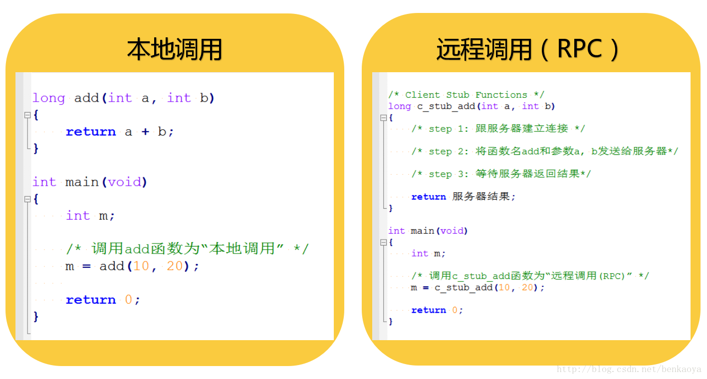
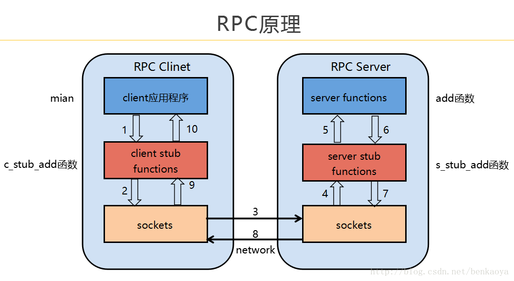
被调用方法的具体实现不在同一个进程，而是在别进程，甚至别的电脑上。RPC一个重要思想就是，使远程调用看起来像本地调用一样，调用者无需知道被调用接口具体在哪台机器上执行。

# web Service
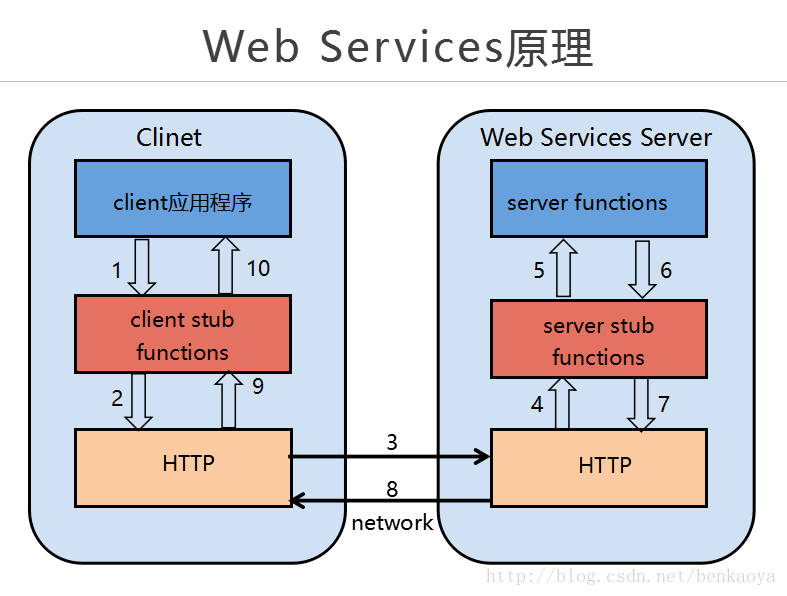  
当你的系统完成一个通用的功能以后，如果你想让别人使用你的功能的话，那么你就可以发布成为Web Services服务，别人就可以通过网络远程调用到你的服务接口。
## 举例
- 天气预报WEB服务
- http://ws.webxml.com.cn/WebServices/WeatherWS.asmx?op=getWeather
## web service常用的框架
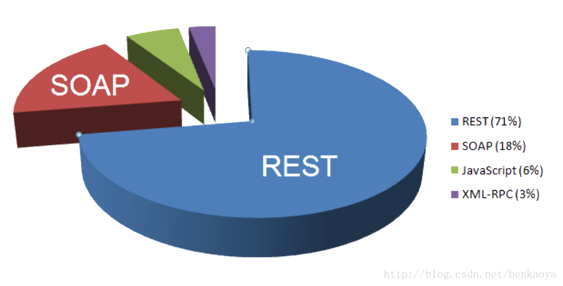 
- 实现Web Services的方式有好几种
- soap是web service框架中的一种

# SOAP协议(Simple Object Access Protocol)
- 是基于XML的一种协议,是建立再HTTP基础上的.一条SOAP消息就是一个普通的XML 文档
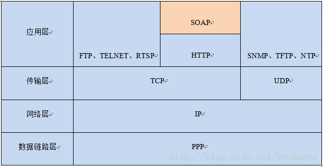
- SOAP是在http协议之上  

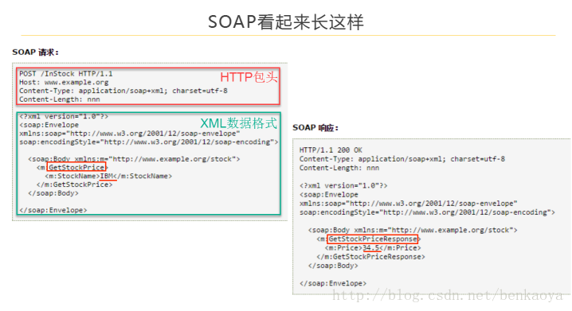  
- 这个一个股票Web Services服务系统，其中GetStockPrice接口适用于查询股票当前价格，图中查询了IBM的股票价格，Web Services返回股票价格为34.5

## SOAP的简单理解
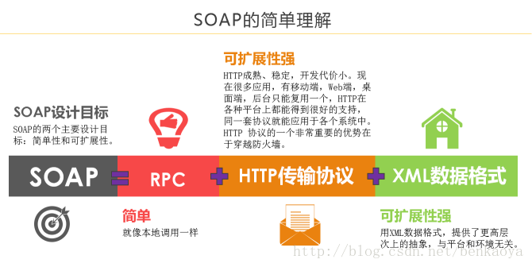
- SOAP协议 = RPC机制 + HTTP传输协议 + XML数据格式
### 举例
- 比如GetStatus请求长这样（POST的body部份就是SOAP格式）：
```
POST /onvif/device_service HTTP/1.1
Host: 192.168.220.128
Content-Type: application/soap+xml; charset=utf-8
Content-Length: 333

<?xml version="1.0" encoding="utf-8"?>
<s:Envelope xmlns:s="http://www.w3.org/2003/05/soap-envelope" xmlns:tptz="http://www.onvif.org/ver20/ptz/wsdl" xmlns:tt="http://www.onvif.org/ver10/schema">
  <s:Body>
    <tptz:GetStatus>
      <tptz:ProfileToken>prof0</tptz:ProfileToken>
    </tptz:GetStatus>
  </s:Body>
</s:Envelope>
```
  
## WSDL(Web Services Description Language，网络服务描述语言)

- 对于一个Web Services，我们如何知道它对外提供了多少个接口，以及每个接口是如何调用的，这就涉及到WSDL。
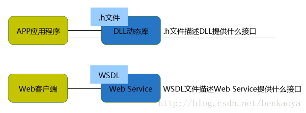
- WSDL是服务端用来向客户端描述自己实现哪些请求、发送请求时需要带上哪些参数xml组织格式；SOAP是客户端向服务端发送请求时的参数的xml组织格
- 注意：只有SOAP方式实现的Web Services才有WSDL文档，其他方式实现的Web Services并没有WSDL文档。
- 我们可以这么理解WSDL：WSDL是一个使用XML语言书写的文档，这个文档描述了Web Services对外提供了哪些接口，就像动态库的`.h`文件一样。每个Web Services都有对应的WSDL文档。
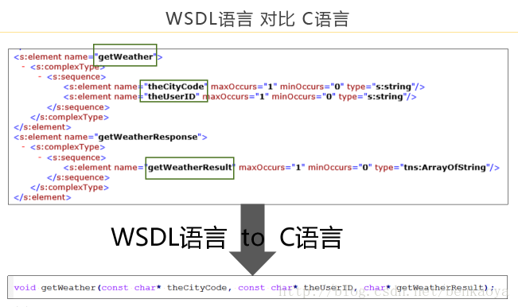
- https://www.onvif.org/onvif/ver10/device/wsdl/devicemgmt.wsdl

# 接口规范
- ONVIF接口被划分为不同模块，包括：设备发现、设备管理、设备输入输出服务、图像配置、媒体配置、实时流媒体、接收端配置、显示服务、事件处理、PTZ控制等。

- 每个模块的接口都有相对应的WSDL文档进行描述，可以在ONVIF官网「Network Interface Specifications」中查阅，链接如下：  
https://www.onvif.org/profiles/specifications/

- 如果想快速浏览ONVIF所有模块的常用接口，请看这里「ONVIF 2.0 Service Operation Index」，链接如下：  
https://www.onvif.org/onvif/ver20/util/operationIndex.html

注意：这里仅仅是列出常用接口，不是全部接口，每个模块的全部接口需要进入每个模块的WSDL中去看，点击任意一个接口就会自动跳转到对应的WSDL文档链接处。

比如说GetServices接口以上页面没有显示，但在http://www.onvif.org/ver10/device/wsdl/devicemgmt.wsdl中是的。所以想看全部的接口，还是得深入每个wsdl才行啊。

# gSOAP
- 根据`wsdl`文档生成c/c++源码(框架)

# 开发流程
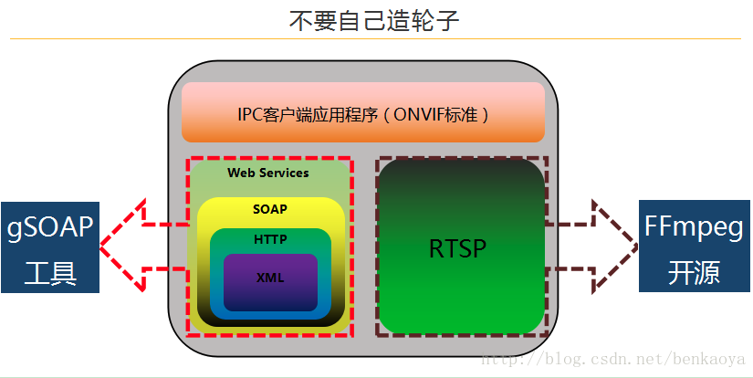
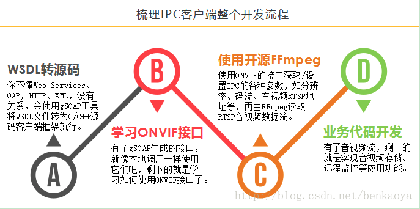 
1. 利用组播技术搜索同一网段下所有支持onvif的设备
2. 获取设备能力GetCapabilities
3. 获取设备支持的所有profiles, GetProfiles
4. 获取实时流地址, getStreamUri


# 工具
- ONVIF Device Test Tool

# 开源库
- https://github.com/use-go/onvif

# 为何不用gSOAP
- 工具自动生成的代码，出问题难以维护
- c/c++有潜在段错误、内存泄露风险