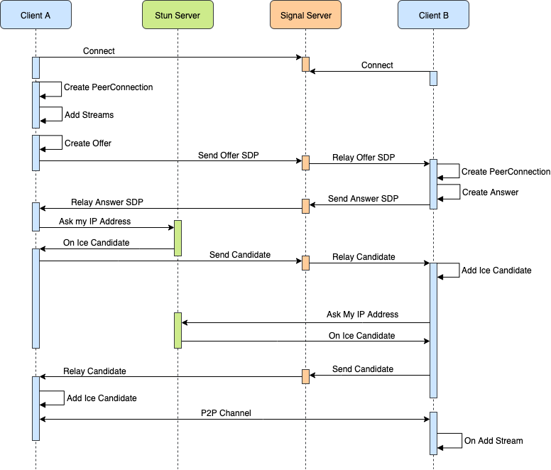

# 概要
- 第一，通信双方需要先通过服务器交换一些信息
- 第二，完成信息交换后，通信双方将直接进行连接以传输音视频数据

# 组成
## 信令
webrtc规定了需要交换`sdp`，具体怎么交换，以及交换的方式，没有规定
- 信令服务器
- 传输协议
  - websocket
  - sip
  - http(srs)
- 流程
  - 收集信息
      - 需要的服务
        - STUN
          - 获取自己公网ip
          - p2p打洞
        - TURN - relay
        - ICE - 二者整合
    - 公网ip
    - NAT类型
      
  - 交换sdp
  - 建立p2p通道
  
## 流媒体
  - srtp

# 流程

